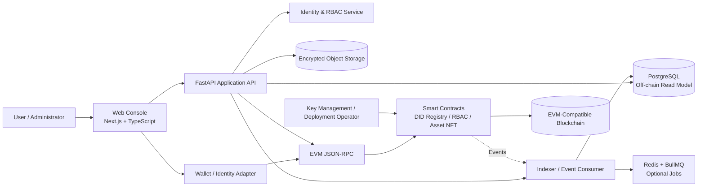

# Blockchain Secure Platform

[](https://github.com/tejaswin-amara/Blockchain-Based-Secure-Platform-for-Identity-Access-Control-and-Digital-Asset-Management/actions/workflows/ci.yml)
[](https://securityscorecards.dev/viewer/?uri=github.com/tejaswin-amara/Blockchain-Based-Secure-Platform-for-Identity-Access-Control-and-Digital-Asset-Management)
[](LICENSE)
[](https://www.conventionalcommits.org/)

**Blockchain Secure Platform** is an MVP reference architecture for decentralized identity, smart-contract-enforced role-based access control, and NFT-backed digital-asset ownership. It is designed for security-conscious organizations that need verifiable identity-to-asset relationships, controlled administrative workflows, and an immutable event trail without placing sensitive personal data directly on-chain.

The project is tailored to the **Blockchain & Cybersecurity** domain and is intended as a technical foundation for evaluation by **Bharat Electronics Limited**. It is not a production security certification, a legal opinion, or an endorsement by Bharat Electronics Limited. Production use requires a formal threat model, privacy review, key-management design, smart-contract audit, operational controls, and an approved deployment policy.

> **Core principle:** Put proofs, identifiers, hashes, roles, and state transitions on-chain; keep sensitive personal data and large files off-chain, encrypted, access-controlled, and governed by an explicit retention policy.

## What the platform provides

The platform connects four trust functions into one auditable workflow. A decentralized identifier (DID) represents an identity independently of a single application database. Smart contracts enforce administrator-controlled role assignment and permission checks. Digital assets are represented by unique non-fungible tokens (NFTs) whose ownership history can be independently verified. Contract events provide a tamper-evident history for identity, asset, allocation, transfer, and permission operations. DID terminology follows the W3C Decentralized Identifiers model, while NFT behavior is documented against the ERC-721 interface conventions.[1] [2]

The MVP deliberately separates **on-chain truth** from **off-chain application services**. A contract should not store raw identity documents, credentials, biometric data, secrets, or regulated personal information. Instead, the application stores encrypted metadata and records only the minimum cryptographic references needed to verify integrity and authorization.

## Architecture at a glance



### Trust boundaries

The **wallet or identity adapter** signs user intent; it does not make an identity trustworthy by itself. The **FastAPI service** validates input and assembles application views but cannot rewrite blockchain history. The **smart-contract layer** is the authorization boundary for state-changing asset and role operations. The **database, job queue, and object store** are replaceable off-chain components and must be treated as recoverable projections, not as the source of ownership truth.

## Quickstart

### Prerequisites

Install the following before starting:

| Requirement | Recommended version | Purpose |
|---|---:|---|
| Git | 2.40+ | Source control |
| Node.js | 22 LTS | Hardhat contracts and Next.js frontend |
| pnpm | 9+ | JavaScript workspace management |
| Python | 3.11+ | FastAPI service and tooling |
| Docker | 24+ | PostgreSQL, Redis, and MinIO local dependencies |
| Foundry or a compatible wallet | Current stable | Optional contract interaction and testnet workflows |

### Clone and configure

```bash
git clone https://github.com/tejaswin-amara/Blockchain-Based-Secure-Platform-for-Identity-Access-Control-and-Digital-Asset-Management.git
cd Blockchain-Based-Secure-Platform-for-Identity-Access-Control-and-Digital-Asset-Management
cp .env.example .env
```

Review `.env` before running anything. Use local-only test accounts and throwaway keys for development. Never commit `.env`, private keys, seed phrases, production RPC credentials, or real identity data.

### Start local dependencies

```bash
docker compose up -d postgres redis minio
```

If a Compose file has not yet been added to the implementation repository, start equivalent local services and configure their connection strings using `.env`. The documentation suite intentionally does not assume that containers are available in the first prototype commit.

### Install workspace dependencies

```bash
pnpm install
python3 -m venv .venv
. .venv/bin/activate
python -m pip install --upgrade pip
pip install -r services/api/requirements.txt
```

### Run contract tests

```bash
pnpm --filter contracts test
pnpm --filter contracts compile
```

Contract tests should cover unauthorized minting, unauthorized role changes, duplicate allocation, ownership transfer, event emission, paused or emergency states, and any upgradeability policy. Do not deploy an unreviewed contract to a public network.

### Run the API and frontend

```bash
pnpm --filter web dev
. .venv/bin/activate && uvicorn services.api.app:app --reload --port 8000
```

The expected local endpoints are `http://localhost:3000` for the web console and `http://localhost:8000` for the API. Exact commands may change as implementation packages are introduced; keep this README and the ADR synchronized with those changes.

### Run quality checks

```bash
pnpm lint
pnpm test
pnpm build
python -m pytest services/api/tests
```

For browser-level validation, run the Cypress suite after the web and API services are available. Accessibility checks should be part of the same review path, using automated checks as a baseline rather than a substitute for manual keyboard and screen-reader testing.[3]

## Representative domain flows

### Identity registration

An authorized operator creates or registers an identity record, associates a DID or DID reference with the application subject, and emits an event containing only the minimum public verification material. Revocation and key rotation must be explicit operations. A DID reference is not a guarantee that the subject is a real-world person or organization; that assurance comes from the platform's approved verification process.

### Role and permission assignment

An administrator assigns a predefined role such as `ADMIN`, `MANAGER`, `AUDITOR`, or `USER`. Contracts enforce who may grant or revoke roles, and the API mirrors the resulting state for user interfaces. The implementation must define whether roles are global, tenant-scoped, asset-scoped, or time-bound before production deployment.

### Asset minting and allocation

An authorized administrator mints a unique NFT with a controlled metadata reference, associates the token with an identity reference, and emits an allocation event. The platform must prevent unauthorized minting, duplicate allocation, and silent reassignment. Ownership transfer is valid only when the contract's policy and the organization's governance process permit it.

### Verification and audit

A verifier reads contract state and events, confirms the asset identifier and ownership history, and compares the metadata hash with the approved off-chain object. The application may provide a convenient read model, but independent verification should remain possible using the chain, contract addresses, ABI, and published deployment metadata.

## Default technology stack versus alternatives

| Capability | MVP default | Viable alternative | Decision criterion |
|---|---|---|---|
| Contract language | Solidity | Vyper | Use Solidity for ecosystem maturity and OpenZeppelin compatibility; reassess for specialized assurance needs |
| Contract framework | Hardhat | Foundry | Use Hardhat for TypeScript integration; use Foundry when Solidity-native testing and fuzzing become primary |
| Contract libraries | OpenZeppelin Contracts | Solmate or audited internal modules | Prefer well-maintained, reviewed primitives; never replace them only to reduce dependency count |
| Identity model | DID reference plus application verification | Enterprise PKI, Verifiable Credentials, or a permissioned identity network | Choose based on assurance, revocation, interoperability, and organizational policy |
| Blockchain | Local Hardhat network, then approved EVM testnet | Hyperledger Besu, Polygon PoS, private EVM network | Select for governance, finality, privacy, cost, operational ownership, and regulatory constraints |
| API | FastAPI + Pydantic + Web3.py | NestJS, Go, or a managed indexer | Choose based on team skills, latency, event-processing needs, and operational support |
| Database | PostgreSQL | MySQL/TiDB or a managed relational service | Use a relational projection for queryability; chain remains the ownership source of truth |
| Frontend | Next.js + React + TypeScript | Vite + React or another approved frontend | Choose based on deployment model, wallet support, accessibility, and team conventions |
| UI foundation | shadcn/ui and accessible primitives | Material UI or an internal design system | Select the system with the strongest accessibility and governance fit |
| Jobs | Redis + BullMQ | Celery, Temporal, or cloud queues | Use a durable workflow system when indexing, retries, and reconciliation become business-critical |
| Object storage | S3-compatible storage such as MinIO locally | Managed S3, Azure Blob, or encrypted enterprise storage | Select according to data residency, retention, encryption, and availability requirements |
| Browser testing | Cypress | Playwright | Use whichever is standardized by the organization; keep critical flows deterministic |
| Delivery | GitHub Actions + Docker Compose | GitLab CI, Azure DevOps, or Kubernetes | Select based on the organization's approved software supply-chain controls |

## Repository layout

```text
.
├── apps/
│   └── web/                  # Next.js web console
├── contracts/                # Solidity contracts, tests, scripts, deployments
├── services/
│   ├── api/                  # FastAPI application
│   └── indexer/              # Event ingestion and reconciliation
├── packages/
│   ├── config/               # Shared configuration and validation
│   ├── types/                # Shared domain types and schemas
│   └── ui/                   # Reusable accessible UI components
├── docs/
│   ├── ADR/                  # Architecture Decision Records
│   ├── threat-model/         # Threat model and abuse cases
│   └── runbooks/             # Operational procedures
├── .github/                  # Issues, workflows, ownership, and automation
├── .devcontainer/            # Reproducible development environment
└── docker-compose.yml        # Local infrastructure, when implementation lands
```

## Security and privacy boundaries

Treat private keys as high-impact credentials. Use a hardware-backed or managed key-management solution for privileged production actions, enforce multi-party approval where appropriate, and document key rotation and recovery. The contract administrator should not be a single unreviewed externally owned account in a production deployment.

The platform must not expose personal data through public events, token metadata, logs, error messages, or analytics. Hashing data does not automatically remove privacy risk when the underlying data can be recovered or linked. Define retention, erasure, revocation, subject-access, and legal-review procedures before storing identity-related data.

The repository's `SECURITY.md`, `ARCHITECTURE.md`, ADRs, and [`docs/COMPLIANCE-REPORT.md`](docs/COMPLIANCE-REPORT.md) describe the intended controls and current evidence boundaries. They do not replace an organization-specific security assessment.

## Project status

The project is at the **prototype/MVP documentation stage**. The repository contains architecture and governance defaults, not evidence of a deployed or audited system. Roadmap progress, supported networks, contract addresses, and release artifacts should be updated as implementation work is accepted.

## Contributing and support

Read [`CONTRIBUTING.md`](CONTRIBUTING.md) before opening a pull request. Security vulnerabilities must follow [`SECURITY.md`](SECURITY.md), not a public issue. General questions belong in [`SUPPORT.md`](SUPPORT.md). Architectural changes should follow the RFC and ADR workflow in [`GOVERNANCE.md`](GOVERNANCE.md). Proposal alignment and production-gate status are tracked in [`docs/COMPLIANCE-REPORT.md`](docs/COMPLIANCE-REPORT.md).

## License and citation

This project is released under the [MIT License](LICENSE). If this reference architecture informs research, internal engineering, or a derivative implementation, see [`CITATION.cff`](CITATION.cff) for citation metadata.

## References

[1]: https://www.w3.org/TR/did-core/ "W3C Decentralized Identifiers (DIDs) v1.0"
[2]: https://eips.ethereum.org/EIPS/eip-721 "ERC-721: Non-Fungible Token Standard"
[3]: https://www.deque.com/axe/ "Deque axe accessibility engine"
[4]: https://docs.openzeppelin.com/contracts/ "OpenZeppelin Contracts documentation"
[5]: https://12factor.net/config "The Twelve-Factor App: Config"
[6]: https://docs.github.com/en/actions/security-for-github-actions/security-guides/security-hardening-for-github-actions "GitHub Actions security hardening"
